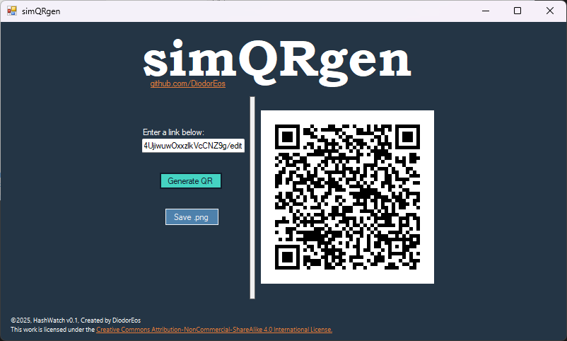

# simQRgen - simple QR generator

## ✨ What's this?

A lightweight, handmade QR code generator built with `WinForms` (`.NET 8`) and `C#`. Mainly created to generate QR codes
from links. Visual Studio files are uploaded, in case anyone wants to customize it.

No subscriptions. No hidden paywalls. Just a simple tool that works.

##### 🔑 Keywords: `qr-code` `generator` `winforms` `.net8` `opensource` `C#` `security-first` `handmade` `modular` `free-tool`

## ✨ Reason for creation
I built **simQRgen** because I was tired of seeing endless "AI-powered" QR code services online that lock basic functionality behind subscriptions.  
Generating a QR code should be free, fast and local, and definitely not tied to a monthly plan or countless trackers and cookies.

## 🚀 Features
- Generate QR codes from text, URLs or any string
- Save QR codes as a PNG image
- Self-contained executable: runs without installation or external dependencies. Click and play!
- Minimal, security-first, single-action design

## 📸 Screenshot

## 📦 How-to use
1. Download the latest release
2. Run the executable
3. Enter your text or link, generate, and save your QR code
